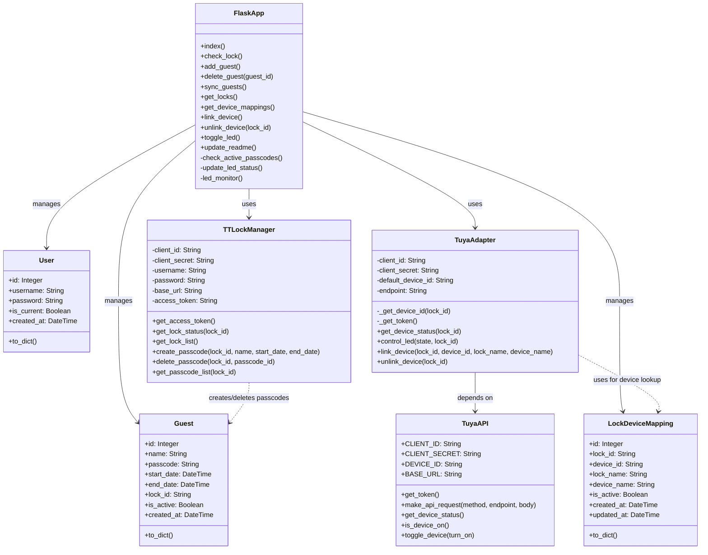
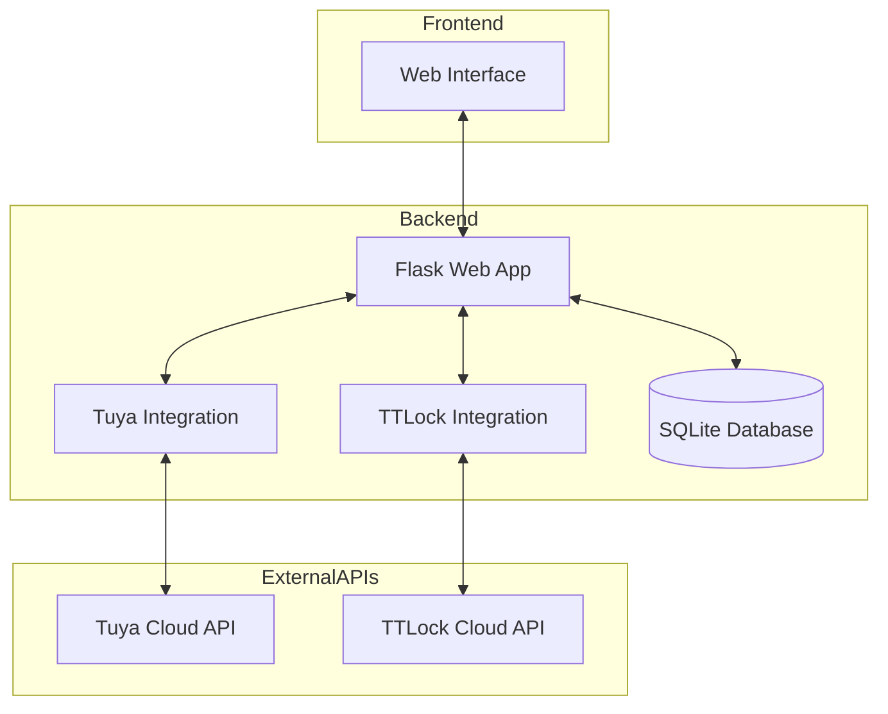
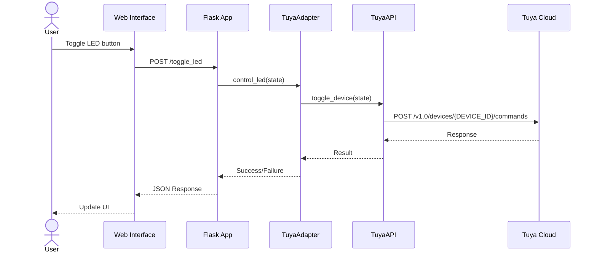

# Rettlock Info System Architecture

## System Overview

This document provides a visual representation of the Rettlock Info system architecture, showing the relationships between different components and their interactions.

## Class Diagram



## Component Diagram



## Sequence Diagram: LED Control



## Directory Structure

```
rettlockinfo/
│
├── web_app.py             # Main Flask application
├── models.py              # Database models
├── tuya_api.py            # Core Tuya API integration module
├── tuya_adapter.py        # Adapter for Tuya API integration
├── smart_lock_manager.py  # TTLock integration 
├── utils.py               # Utility functions
│
├── templates/             # HTML templates
│   └── index.html         # Main UI template
│
├── instance/              # SQLite database
│   └── ttlock.db
│
├── static/                # Static assets
│   ├── css/
│   └── js/
│
├── archive/               # Archived code and files
│
└── docs/                  # Documentation
