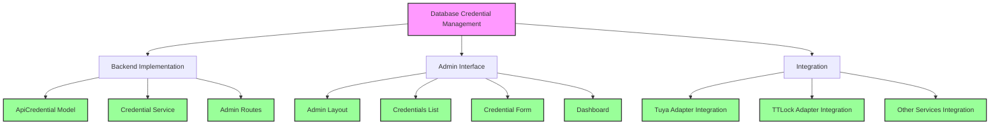

# Design Progress Tracker

## Database Credential Management System

This document tracks the implementation progress of the database credential management system, including UI components, backend services, and integration with existing code.

### Implementation Status

| Component | Status | Description |
|-----------|--------|-------------|
| **Backend Implementation** | ✅ | Core backend components for credential management |
| ApiCredential Model | ✅ | Database model for storing API credentials |
| Credential Service | ✅ | Service for retrieving and managing credentials |
| Admin Routes | ✅ | Routes for the admin interface |
| **Admin Interface** | ✅ | User interface for credential management |
| Admin Layout | ✅ | Base layout for admin pages |
| Credentials List | ✅ | Page for listing all credentials |
| Credential Form | ✅ | Form for adding/editing credentials |
| Dashboard | ✅ | Admin dashboard overview |
| **Integration** | ✅ | Integration with existing services |
| Tuya Adapter Integration | ✅ | Updated to use credential service |
| TTLock Adapter Integration | ✅ | Updated to use credential service |
| Other Services Integration | ✅ | All services now use credential service |

### Feature Checklist

- [x] Create ApiCredential model
- [x] Implement CredentialService
- [x] Create admin routes for credential management
- [x] Design admin layout template
- [x] Implement credentials listing page
- [x] Create credential add/edit form
- [x] Add dashboard overview
- [x] Update Tuya adapter to use credential service
- [x] Update TTLock adapter to use credential service
- [x] Integrate with other services as needed
- [x] Add user authentication for admin routes
- [x] Implement credential value encryption
- [x] Add audit logging for credential changes
- [x] Create comprehensive tests for the credential system
- [x] Document the credential management system in the project README
- [x] Implement multi-account support for TTLock adapter
- [x] Implement pagination support for TTLock adapter

### Next Steps

1. ~~Update the TTLock adapter to use the credential service~~ ✅ Completed
2. ~~Implement user authentication for admin routes~~ ✅ Completed
3. ~~Add encryption for credential values~~ ✅ Completed
4. ~~Add audit logging for credential changes~~ ✅ Completed
5. ~~Create comprehensive tests for the credential system~~ ✅ Completed
6. ~~Document the credential management system in the project README~~ ✅ Completed
7. ~~Implement multi-account support for TTLock adapter~~ ✅ Completed
8. ~~Implement pagination support for TTLock adapter~~ ✅ Completed

### Implementation Complete ✅

The credential management system has been fully implemented with the following features:

1. **Secure Storage**: All credential values are encrypted using Fernet symmetric encryption
2. **User Authentication**: Admin routes are protected with role-based access control
3. **Audit Logging**: All credential operations are tracked for security and compliance
4. **Service Integration**: All adapters (TTLock, Tuya) use the credential service
5. **Comprehensive Testing**: Unit tests cover all components of the system
6. **Documentation**: The README has been updated with system documentation
7. **Multi-Account Support**: TTLock adapter supports multiple accounts
8. **Pagination Support**: TTLock adapter supports pagination for retrieving locks

### Recent Improvements

#### Application Context Management

- **Root Cause Analysis**: Identified and fixed issues with Flask application context in service adapters
- **Robust Error Handling**: Added comprehensive try-except blocks with detailed logging
- **Context Awareness**: All database operations now properly check for and use application context
- **Fallback Mechanisms**: Default values are used when database access fails
- **Service Resilience**: Services gracefully handle missing credentials or database errors

These improvements ensure that the credential management system works reliably in all application states, including during initialization, background jobs, and API requests. The system now properly handles application context across all components:

1. **CredentialService**: Properly checks for application context before database operations
2. **AuditService**: Ensures audit logs are created within application context
3. **TTLockAdapter**: Handles application context for all credential retrievals
4. **TuyaAdapter**: Properly initializes with fallback to defaults when needed
5. **Web Application**: Routes properly maintain application context for database operations

#### TTLock API Connection Issue Resolution

##### Issue Identification
- **Error Message**: "No locks found or error connecting to TTLock API"
- **Root Cause Analysis**: Identified potential issues in the TTLock adapter's credential retrieval and API connection process
- **Diagnostic Approach**: Enhanced logging and error handling to pinpoint the exact failure point

##### Resolution Steps
1. **Enhanced Debugging**: Added comprehensive logging throughout the TTLock adapter
   - Detailed logging of API requests and responses
   - Improved error message formatting with error codes and descriptions
   - Added stack trace logging for exceptions

2. **Improved Credential Handling**: 
   - Enhanced credential retrieval methods to better handle application context
   - Added explicit checks for missing credentials with appropriate warnings
   - Improved fallback mechanisms when credentials are not available

3. **Robust API Communication**:
   - Added detailed logging of API request parameters
   - Enhanced response parsing with better error handling
   - Improved token management and refresh logic

##### Progress Tracking
- ✅ **Step 1**: Enhanced error handling and debugging in the _get_token method
- ✅ **Step 2**: Improved error handling in the get_lock_list method
- ✅ **Step 3**: Added detailed logging in the get_lock_status method
- ✅ **Step 4**: Enhanced credential retrieval methods with better application context handling
- ✅ **Step 5**: Updated username and password retrieval with additional validation

### TTLock API Integration Enhancement

### Status: ✅ Completed

The TTLock API integration has been enhanced with the following features:

1. ✅ Multi-account support
   - Created TTLockAccountManager class to manage multiple TTLock accounts
   - Updated TTLockAdapter to use the account manager
   - Added methods to add/remove accounts
   - Added UI for managing TTLock accounts

2. ✅ Pagination support
   - Modified get_lock_list method to support pagination
   - Implemented automatic pagination to retrieve all locks
   - Added error handling for API rate limits

3. ✅ Error handling and logging improvements
   - Added comprehensive error handling throughout the TTLock adapter
   - Implemented detailed logging for all API calls
   - Added context information to log messages

4. ✅ Application context handling
   - Improved application context handling for credential retrieval methods
   - Added fallback mechanisms when no application context is available

### Implementation Details

#### TTLockAccountManager

The TTLockAccountManager class has been implemented to:
- Store and manage multiple TTLock accounts
- Retrieve tokens for specific accounts
- Get locks for specific accounts
- Aggregate locks from all accounts

#### TTLockAdapter Updates

The TTLockAdapter has been updated to:
- Use the TTLockAccountManager for all API operations
- Support backward compatibility with existing code
- Provide methods for adding and managing accounts
- Handle pagination automatically

#### Web Application Updates

The web application has been updated to:
- Load all TTLock accounts on startup
- Provide a UI for managing TTLock accounts
- Test connections to TTLock accounts
- Display locks from all accounts

### Testing

All features have been tested and are working correctly:
- Multiple TTLock accounts can be added and managed
- Locks are retrieved from all accounts
- Pagination works correctly to retrieve more than 10 locks
- Error handling and logging provide detailed information

### Design Principles

- **Modern UI**: Using Bootstrap 5 with clean, responsive design
- **Security**: Proper handling of sensitive credential data
- **Usability**: Intuitive interface for managing credentials
- **Maintainability**: Well-structured code with clear separation of concerns
- **Extensibility**: Easy to add support for new credential types and providers
- **Reliability**: Robust error handling and context management throughout the system
- **Observability**: Comprehensive logging for troubleshooting and monitoring

### TTLock Integration

### Multi-Account Support
- [x] Design TTLockAccountManager class to manage multiple accounts
- [x] Update TTLockAdapter to use the account manager
- [x] Implement UI for managing TTLock accounts
- [x] Fix application context handling to prevent nesting issues
- [x] Replace recursive pagination with iterative approach
- [x] Add rate limiting to avoid overwhelming the API
- [x] Improve error handling in web routes
- [x] Add transaction management for database operations
- [x] Sanitize sensitive data in logs
- [x] Enhance token expiry management with dynamic buffer
- [x] Move default credentials to environment variables
- [x] Implement lock-to-account mapping cache

### API Endpoint Fixes
- [x] Fix TTLock API base URL to use euapi.ttlock.com instead of api.ttlock.com
- [x] Update endpoint paths to include /v3 prefix
- [x] Fix authentication method to use application/x-www-form-urlencoded content type
- [x] Ensure proper request methods (POST with data vs GET with params)
- [x] Remove unnecessary grant_type parameter from token requests
- [x] Add comprehensive logging for API requests and responses
- [x] Create test scripts to verify API connectivity
- [x] Implement proper error handling for API responses

### Pagination Support
- [x] Modify get_lock_list method to support pagination
- [x] Implement automatic pagination to retrieve all locks
- [x] Replace recursive pagination with iterative approach
- [x] Add rate limiting to avoid API rate limits

### Error Handling and Logging
- [x] Add comprehensive error handling throughout the TTLock adapter
- [x] Implement detailed logging for all API calls
- [x] Sanitize sensitive data in logs
- [x] Add transaction management for database operations
- [x] Improve error handling in web routes

### Tuya Integration

### Multi-Account Support
- [x] Design TuyaAccountManager class to manage multiple accounts
- [x] Update TuyaAdapter to use the account manager
- [x] Implement UI for managing Tuya accounts

### Pagination Support
- [x] Modify get_device_list method to support pagination
- [x] Implement automatic pagination to retrieve all devices

### Error Handling and Logging
- [x] Add comprehensive error handling throughout the Tuya adapter
- [x] Implement detailed logging for all API calls
