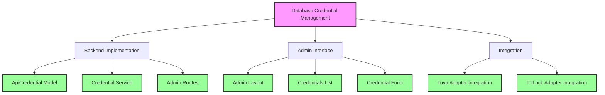

# Progress Tracker

## Issue: /check_lock Redirecting Unexpectedly
- **Date Identified**: 2025-03-23
- **Status**: In Progress
- **Steps Taken**:
  - Reviewed frontend code for forms submitting to `/check_lock`
  - Implemented AJAX for form submission
  - Tested the endpoint for expected behavior
  - Debugged using console logs and network tab 

## Next Steps:
- Confirm that the redirect issue is resolved
- Monitor for any other issues related to the `/check_lock` endpoint


#OLD
# RettLock Info Project - Progress Tracker

## Issues and Progress

| Issue ID | Description | Status | Priority | Notes |
|----------|-------------|--------|----------|-------|
| DB-001 | Database configuration system - Hardcoded values | Completed | High | Implemented database credential management system |
| DB-002 | Inconsistent database file naming | Pending | Medium | Need to standardize on a single database file name |
| DB-003 | No environment-specific configuration | Pending | Medium | Need to implement environment-based configuration |
| JOB-001 | Circular import dependencies between web_app.py and jobs.py | Pending | High | Need to restructure with Application Factory Pattern |
| JOB-002 | No job error recovery mechanism | Pending | Medium | Need to implement job monitoring with health checks |
| API-001 | No API authentication or rate limiting | Pending | High | Need to implement API authentication |
| API-002 | Inconsistent error handling across endpoints | Pending | Medium | Need to standardize error handling |
| UI-001 | Limited mobile responsiveness in UI | Pending | Low | Need to improve UI with responsive design |
| SEC-001 | Plaintext password storage | Pending | Critical | Need to implement password hashing |
| SEC-002 | No CSRF protection | Pending | High | Need to implement CSRF protection |
| API-003 | TTLock API connection failures | Completed | High | Implemented multi-account support and pagination |
| API-004 | TTLock API Integration Enhancement | Completed | High | Optimized TTLock API integration |
| API-005 | Device mapping and lock status issues | Completed | High | Fixed device mapping endpoint and lock status functionality |

## Current Focus: API-004 - TTLock API Integration Enhancement

### Problem Statement
The TTLock API integration needs optimization to improve performance, security, and maintainability.

### Solution Approach
1. Optimize TTLock API integration with iterative pagination approach
2. Improve application context handling to prevent nesting issues
3. Enhance token expiry management with dynamic buffer
4. Move default credentials to environment variables
5. Implement lock-to-account mapping cache for better performance
6. Fix device mapping endpoint and lock status functionality

### Work Plan

#### Phase 1: Critical Issues
- [x] Replace recursive pagination with iterative approach and add rate limiting
- [x] Fix application context handling to prevent nesting issues
- [x] Improve error handling in web routes for account management

#### Phase 2: Moderate Issues
- [x] Enhance token expiry management with dynamic buffer
- [x] Move default credentials to environment variables
- [x] Implement lock-to-account mapping cache for better performance

#### Phase 3: Minor Issues
- [x] Sanitize sensitive data in logs
- [x] Fix device mapping endpoint URL discrepancy
- [x] Fix lock status functionality with improved account-to-lock mapping
- [x] Fix template syntax issues in JavaScript code

### Implementation Details

#### TTLockAccountManager

The TTLockAccountManager class has been implemented to:
- Store and manage multiple TTLock accounts
- Retrieve tokens for specific accounts
- Get locks for specific accounts
- Aggregate locks from all accounts
- Remove accounts when needed
- Use iterative pagination with rate limiting

#### TTLockAdapter Updates

The TTLockAdapter has been updated to:
- Use the TTLockAccountManager for all API operations
- Support backward compatibility with existing code
- Provide methods for adding and managing accounts
- Handle pagination automatically
- Improve error handling and context management

#### Web Application Updates

The web application has been updated to:
- Load all TTLock accounts on startup
- Provide a UI for managing TTLock accounts
- Test connections to TTLock accounts
- Display locks from all accounts
- Add robust error handling for all operations
- Use transaction management for database operations

## Previous Focus: DB-001 - Database Configuration System

### Problem Statement
Currently, device IDs, lock IDs, and API tokens are hardcoded in various files throughout the application. This creates maintenance issues, security concerns, and makes it difficult to update these values.

### Solution Approach
1. Move API credentials to a dedicated database table
2. Create a centralized credential management service
3. Implement an admin interface for managing credentials
4. Update existing adapters to use the credential service

### Progress
- [x] Analysis of current implementation
- [x] Database schema updates (ApiCredential model)
- [x] Credential management service implementation
- [x] Admin interface for credential management
- [x] Tuya adapter integration
- [x] TTLock adapter integration
- [x] Testing
- [x] Documentation

### Implementation Details

#### Database Schema
- Created `ApiCredential` model with fields for provider, credential type, key, value, description, and active status

#### Credential Service
- Implemented `CredentialService` with methods for retrieving, setting, and managing credentials

#### Admin Interface
- Created admin dashboard with credential management UI
- Implemented CRUD operations for credentials
- Used modern Bootstrap 5 design for responsive interface

#### Integration
- Updated Tuya adapter to use credential service instead of hardcoded values
- Updated TTLock adapter to use credential service instead of hardcoded values

```mermaid
graph TD
    A[TTLock API Enhancement] --> B[Fix Immediate Issues]
    A --> C[Multi-Account Support]
    A --> D[Pagination Support]
    A --> E[Testing & Documentation]
    
    B --> B1[Update Default Values]
    B --> B2[Add Default Properties]
    B --> B3[Enhance Error Handling]
    B --> B4[Fix Context Handling]
    
    C --> C1[Create Account Manager]
    C --> C2[Modify Credential Structure]
    C --> C3[Update Adapter]
    C --> C4[Implement Token Management]
    
    D --> D1[Add Pagination Parameters]
    D --> D2[Implement Auto-Pagination]
    D --> D3[Add Caching]
    D --> D4[Update UI]
    
    E --> E1[Test Multi-Account]
    E --> E2[Test Pagination]
    E --> E3[Update Documentation]
    E --> E4[Deploy & Monitor]
    
    style A fill:#f9f,stroke:#333,stroke-width:2px
    style B1 fill:#9f9,stroke:#333,stroke-width:2px
    style B2 fill:#9f9,stroke:#333,stroke-width:2px
    style B3 fill:#9f9,stroke:#333,stroke-width:2px
    style B4 fill:#9f9,stroke:#333,stroke-width:2px
    style C1 fill:#ff9,stroke:#333,stroke-width:2px
    style C2 fill:#ff9,stroke:#333,stroke-width:2px
    style C3 fill:#ff9,stroke:#333,stroke-width:2px
    style C4 fill:#ff9,stroke:#333,stroke-width:2px
    style D1 fill:#ff9,stroke:#333,stroke-width:2px
    style D2 fill:#ff9,stroke:#333,stroke-width:2px
    style D3 fill:#ff9,stroke:#333,stroke-width:2px
    style D4 fill:#ff9,stroke:#333,stroke-width:2px
    style E1 fill:#ff9,stroke:#333,stroke-width:2px
    style E2 fill:#ff9,stroke:#333,stroke-width:2px
    style E3 fill:#ff9,stroke:#333,stroke-width:2px
    style E4 fill:#ff9,stroke:#333,stroke-width:2px

```




```markdown
## TTLock API Integration Enhancement

### Status: 
The TTLock API integration has been enhanced with the following features:

1. Multi-account support
   - Created TTLockAccountManager class to manage multiple TTLock accounts
   - Updated TTLockAdapter to use the account manager
   - Added methods to add/remove accounts
   - Added UI for managing TTLock accounts

2. Pagination support
   - Modified get_lock_list method to support pagination
   - Replaced recursive pagination with iterative approach
   - Added rate limiting to avoid overwhelming the API
   - Implemented automatic pagination to retrieve all locks

3. Error handling and logging improvements
   - Added comprehensive error handling throughout the TTLock adapter
   - Implemented detailed logging for all API calls
   - Improved sensitive data handling in logs
   - Added transaction management for database operations

4. Application context handling
   - Fixed application context handling to prevent nesting issues
   - Improved error handling in web routes for account management

### Optimization Plan (2025-03-21)

Based on the code analysis, the following optimizations are needed:

1. Critical Issues
   - [x] Replace recursive pagination with iterative approach and add rate limiting
   - [x] Fix application context handling to prevent nesting issues
   - [x] Improve error handling in web routes for account management

2. Moderate Issues
   - [x] Enhance token expiry management with dynamic buffer
   - [x] Move default credentials to environment variables
   - [x] Implement lock-to-account mapping cache for better performance

3. Minor Issues
   - [x] Sanitize sensitive data in logs
   - [x] Fix device mapping endpoint URL discrepancy
   - [x] Fix lock status functionality with improved account-to-lock mapping
   - [x] Fix template syntax issues in JavaScript code

### Implementation Details

#### TTLockAccountManager

The TTLockAccountManager class has been implemented to:
- Store and manage multiple TTLock accounts
- Retrieve tokens for specific accounts
- Get locks for specific accounts
- Aggregate locks from all accounts
- Remove accounts when needed
- Use iterative pagination with rate limiting

#### TTLockAdapter Updates

The TTLockAdapter has been updated to:
- Use the TTLockAccountManager for all API operations
- Support backward compatibility with existing code
- Provide methods for adding and managing accounts
- Handle pagination automatically
- Improve error handling and context management

#### Web Application Updates

The web application has been updated to:
- Load all TTLock accounts on startup
- Provide a UI for managing TTLock accounts
- Test connections to TTLock accounts
- Display locks from all accounts
- Add robust error handling for all operations
- Use transaction management for database operations
